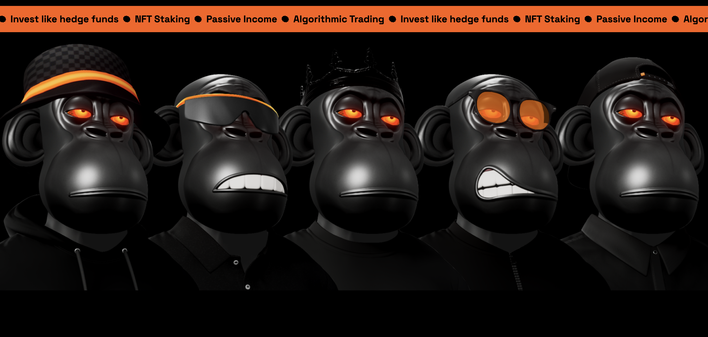
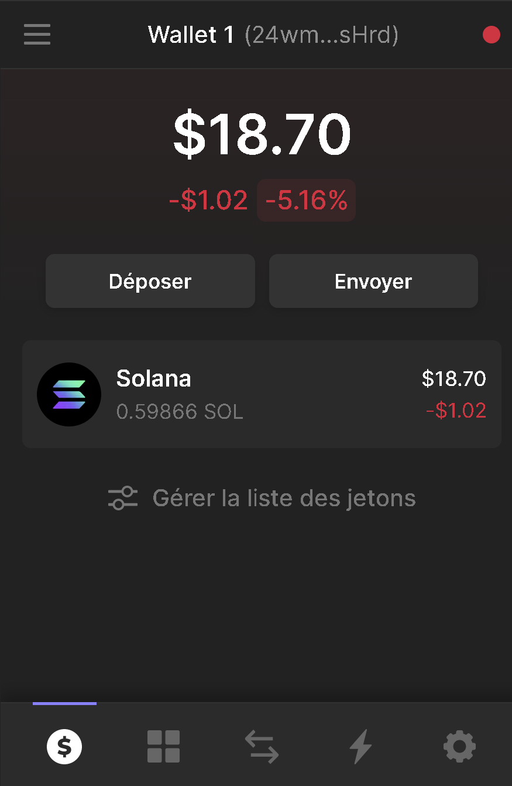
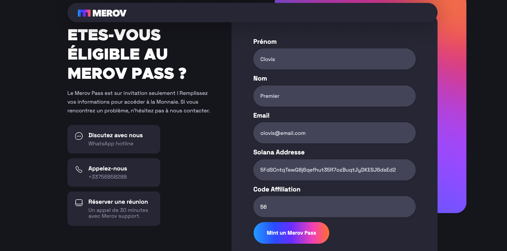
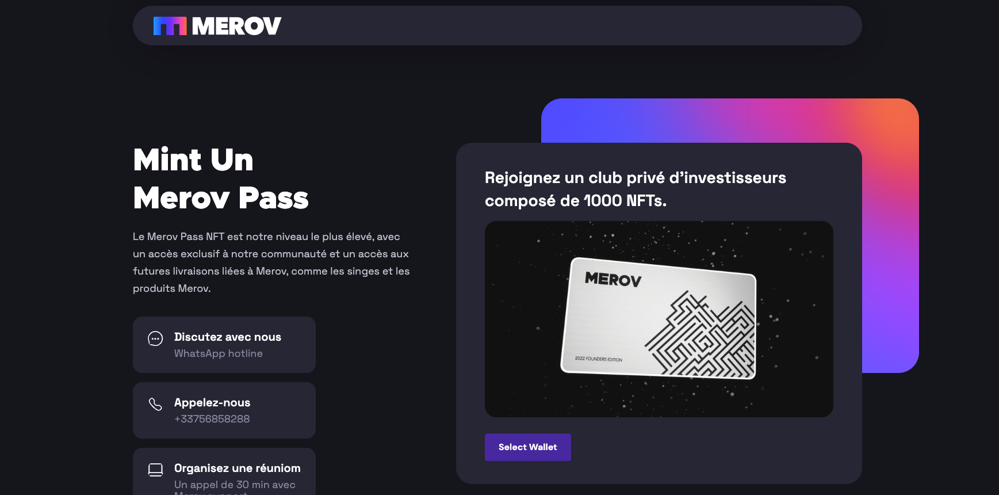
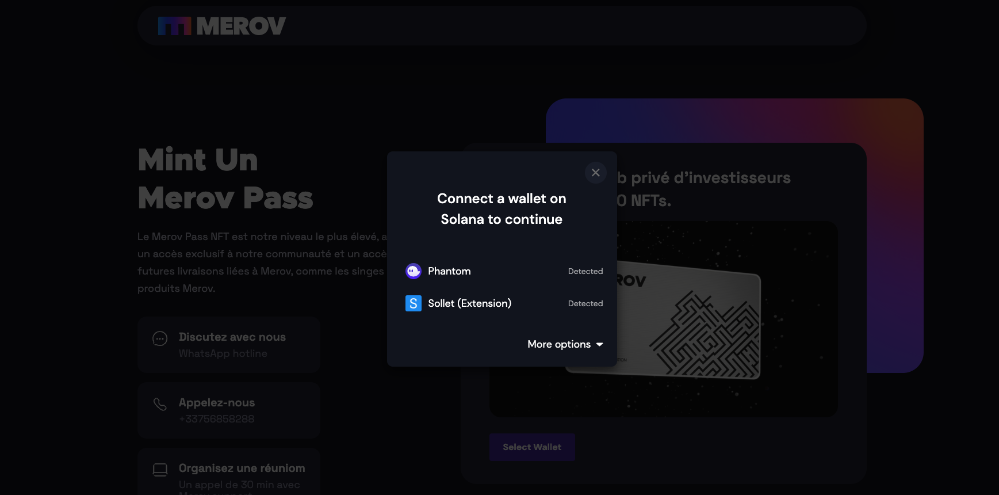
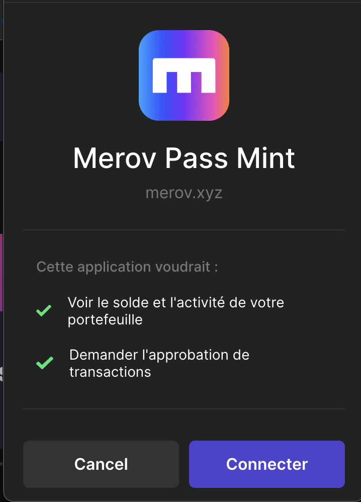
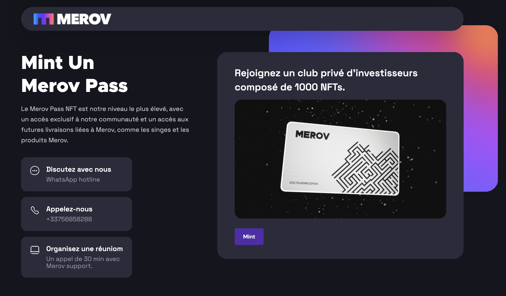
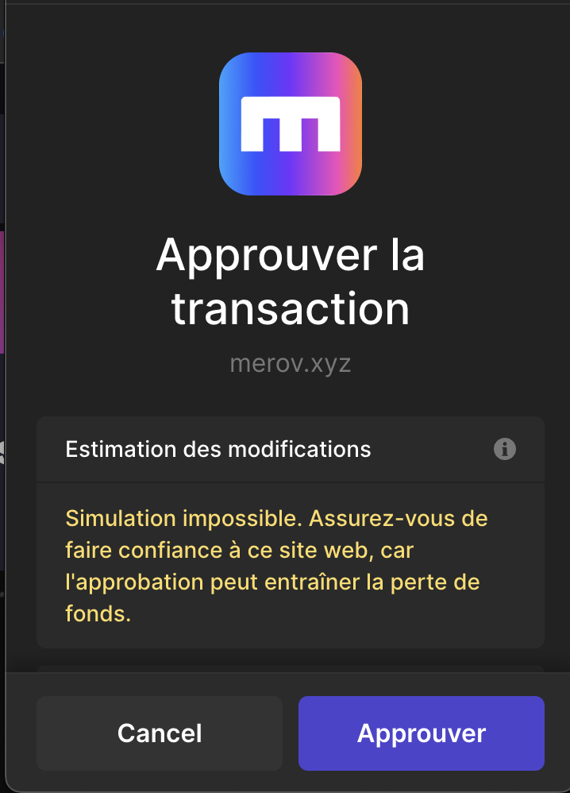
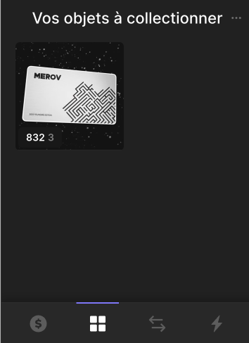

# Merov Pass

## Playliste Merov interview : 
https://www.youtube.com/watch?v=5gY5nqH09CA&list=PLYzS-0iFKsF6Z-w-Puo_NAdsZgaMdcm4G
## Merov Pass 🎫
Mint son Merov Pass Referral : 56

---
https://www.merov.xyz/fr/merovpass-form?source=56

---
Le monde des fonds d’investissement reste inaccessible pour la plupart des personnes de part un ticket d’entrée à 6 chiffres.

MEROV démocratise cette accessibilité avec le Merov Pass qui donne accès à leur fonds d’investissement permettant d’obtenir un des meilleurs ratio risques/performances.

## Merov Capital, c'est quoi ?
Merov Capital est un Family Office (structure de fond d’investissement français) de trading algorithmique pour les investisseurs privés professionnels et institutionnels. 🏦

Crée en 2020 avec $10M d'actifs sous gestion, ils incubent toutes leurs stratégies quantitatives et infrastructures de trading, outils et robots.

Merov Pass est lancé à destination des investisseurs non professionnels (nous) en nous permettant d’utilisé des solutions algorithmiques sur les marchés financiers.
## Résultats des stratégies Merov 📊
Exemple d'une stratégie quantitative à faible risque sur l'ETH en 2022 (max 15% de drawdown)

**+70% de performance face au dollar**

**+470% de performance face a l'ETH.**

La stratégie ETH surperforme de +470% l'ETH depuis le début de l'année 2022. Un investissement de 100 ETH en janvier chez Merov vaut 470 ETH aujourd'hui. 📈

## Merov Pass, c’est quoi ?
Le Merov Pass est un frais d’entrée qui se matérialise sous forme d’un **NFT**.

Celui ci vous permet d'accéder à la plateforme d’investissement et d’utiliser les stratégies de trading. Le Merov Pass comporte également plusieurs avantages non négligeable :

-Accès au club des 1000 millionaires

-Audit de patrimoine & conseils

-Formation et analyse des marchés financiers

-Rapport de performances

-Dividendes sur le NFT en lui même
[
## L’équipe 👨‍👨‍👦‍👦

Ils sont une équipe **de traders natifs (français) en crypto-monnaies** avec 18 années d'expériences combinées à continuellement battre le marché.

L’aventure a commencé avec **Merov Capital**, un Familly Office réservé pour leur capital personnel et uniquement aux plus fortunés & aux investisseurs institutionnels.

Au cours des six dernières années, ils ont aidés des centaines d'investisseurs à prendre **l'avantage sur les banques** d'investissements, les fonds spéculatifs ou encore à mettre en œuvre une **meilleure gestion du risque**, sans oublier de **repérer et informer toutes les arnaques du marché**. 🚨

Aujourd'hui, ils ont un nouvel objectif chez Merov 💪

Fournir le meilleur soutien et les meilleurs produits d'investissement via le **Merov Pass**. Nous développons le meilleur service DeFi en trading algorithmique **dédié aux investisseurs particuliers**.

## La vision 👁
Les services DeFi et la communauté Merov permettront aux investisseurs particuliers d'accéder à des connaissances et à des investissements habituellement réservés aux élites. 📜

Avec Merov, vous aurez la possibilité de:

-Devenir un investisseur plus avisé

-Générer un revenu passif consistent

-Investir dans les meilleurs bot de trading quantitatifs

-Etre un membre à part entière du club privé

## Tutoriel
1. Installer l’extension [Phantom.app](http://Phantom.app) (wallet sur la blockchain Solana) qui vous permettra d’acheter votre Pass Merov

2. Envoyer 30,1 SOL sur votre wallet Phantom depuis vos plateformes (Binance, Kraken, FTX…) 

3. Pour trouver votre adresse de réception Solana de votre wallet Phantom, cliquer sur la parenthèse à coté de “Wallet 1” et votre adresse sera automatiquement copiée. Ou bien, cliquer sur “Déposer”.

4. Une fois les 30,1 SOL sur votre Wallet, vous êtes prêt à acheter votre Pass. 

5.  Cliquer sur ce lien pour accéder au site de Merov : https://zpr.io/pbkkQzV9gcHk

6. Remplir chaque case avec vos informations personnelles et cliquez sur “Mint un Merov Pass” 

7. Referral Code 56

8. Cliquer sur Select Wallet 

9. Cliquer sur Phantom (votre wallet)

10. Cliquer sur “Connecter”

11. Cliquer sur “Mint”

12. Approuver la transaction afin d’acheter votre Pass Merov 

13. Quelques secondes plus tard, vous retrouvez votre Pass Merov dans votre collection NFT 

# C'est tout bon ! Vous faites officiellement partie de l’aventure Merov.
